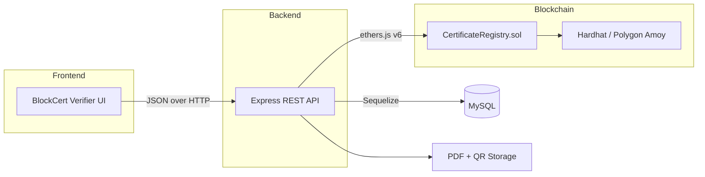
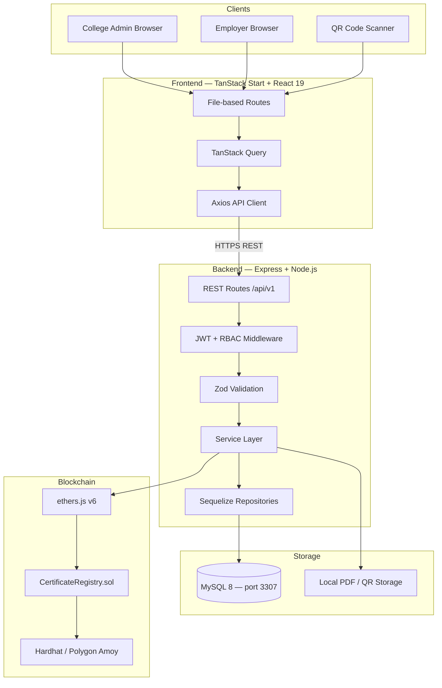
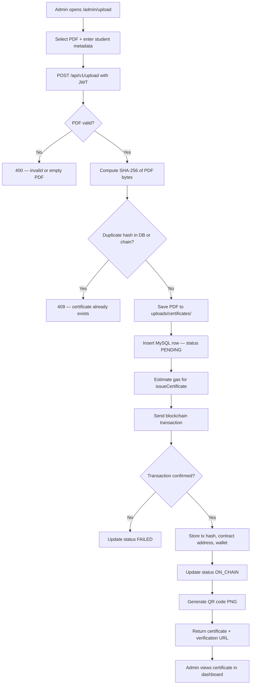
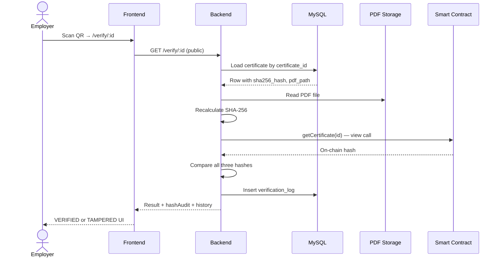
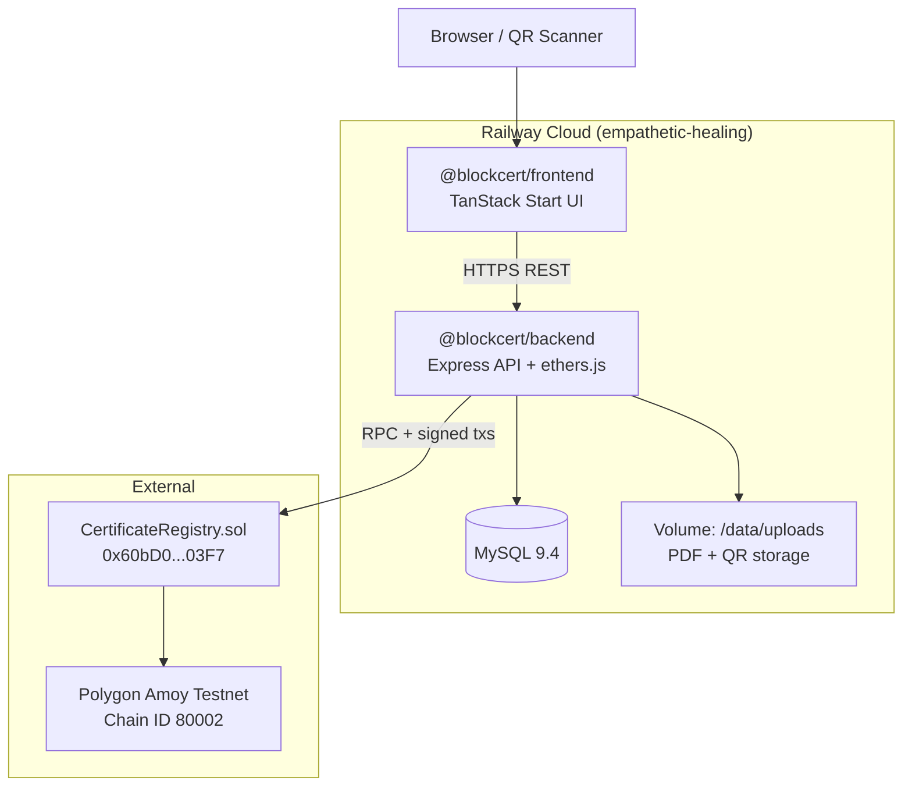

# BlockCert — Complete Project Explanation

**Blockchain Based Certificate Verification System**

*Document for Faculty Evaluation, Viva Voce, and Project Presentation*

---

## Document Information

| Field | Detail |
|-------|--------|
| **Project Title** | BlockCert — Blockchain Based Certificate Verification System |
| **Domain** | Web Application + Blockchain + Information Security |
| **Type** | Final Year Engineering Project (Monorepo) |
| **Target Users** | College administrators (issuers), employers (verifiers), students (indirect) |
| **Blockchain Network** | Polygon Amoy Testnet (live on Railway) / Hardhat Local (development) |
| **Live Demo URLs** | Frontend: blockcertfrontend-production.up.railway.app · API: blockcertbackend-production.up.railway.app |
| **Smart Contract (Amoy)** | `0x60bD0df240D74FFc83f94CE1205FE939413F03F7` |
| **Repository Structure** | npm workspaces — frontend, backend, blockchain |

---

## Table of Contents

1. [Executive Summary](#1-executive-summary)
2. [Problem Statement](#2-problem-statement)
3. [Objectives](#3-objectives)
4. [Existing System vs Proposed System](#4-existing-system-vs-proposed-system)
5. [Scope of the Project](#5-scope-of-the-project)
6. [System Overview](#6-system-overview)
7. [Architecture](#7-architecture)
8. [Technology Stack and Justification](#8-technology-stack-and-justification)
9. [Smart Contract Design](#9-smart-contract-design)
10. [Database Design](#10-database-design)
11. [Certificate Issuance — Detailed Workflow](#11-certificate-issuance--detailed-workflow)
12. [Certificate Verification — Detailed Workflow](#12-certificate-verification--detailed-workflow)
13. [Frontend Application](#13-frontend-application)
14. [Backend API and Business Logic](#14-backend-api-and-business-logic)
15. [Security Measures](#15-security-measures)
16. [Testing and Validation](#16-testing-and-validation)
17. [Live Demonstration Script for Faculty](#17-live-demonstration-script-for-faculty)
18. [Production Deployment — Railway & Polygon Amoy](#18-production-deployment--railway--polygon-amoy)
19. [Results and Outcomes](#19-results-and-outcomes)
20. [Limitations](#20-limitations)
21. [Future Enhancements](#21-future-enhancements)
22. [Conclusion](#22-conclusion)
23. [References and Further Reading](#23-references-and-further-reading)

---

## 1. Executive Summary

**BlockCert** is a full-stack web platform that enables academic institutions to issue digital certificates (PDF format) whose authenticity can be verified independently by any third party — particularly employers — without contacting the college for manual confirmation.

The core innovation is a **dual-layer trust model**:

1. **Off-chain layer (MySQL + file storage):** Stores the PDF, student metadata, and a locally computed SHA-256 hash.
2. **On-chain layer (Polygon blockchain):** Stores only the cryptographic hash and certificate identifier in an immutable smart contract (`CertificateRegistry.sol`).

When an employer verifies a certificate, the system **recalculates** the hash from the stored PDF, **retrieves** the hash from the blockchain, and **compares** both against the database record. If all three match, the certificate is marked **VERIFIED (Authentic)**. Any modification to the PDF after issuance causes a mismatch and the result becomes **TAMPERED**.

The project demonstrates practical integration of:

- Modern web development (React, Node.js, REST APIs)
- Relational database design (MySQL, Sequelize ORM)
- Blockchain development (Solidity, Hardhat, ethers.js)
- Information security (JWT, bcrypt, rate limiting, input validation)

---

## 2. Problem Statement

Academic certificate fraud is a widespread problem. Common issues include:

| Problem | Impact |
|---------|--------|
| Forged certificates | Unqualified candidates gain employment |
| Manual verification | HR departments call colleges; slow and costly |
| Photocopied / edited PDFs | Visual inspection cannot detect subtle tampering |
| Centralized trust | Verifier must trust the college's internal database alone |
| No audit trail | Colleges cannot prove when or how often a certificate was verified |

Traditional solutions — email verification, printed holograms, or proprietary portals — are either **slow**, **expensive**, or **not independently verifiable**.

**Research question addressed by BlockCert:**

> *How can a college issue digital certificates such that any employer can cryptographically verify their authenticity using blockchain as an immutable trust anchor, without storing sensitive student data on-chain?*

---

## 3. Objectives

### 3.1 Primary Objectives

1. **Design and implement** a web-based certificate issuance system for college administrators.
2. **Compute SHA-256 hashes** of certificate PDFs server-side to create tamper-evident fingerprints.
3. **Register hashes on a blockchain** smart contract to provide immutable proof of issuance.
4. **Generate QR codes** linking to a public verification page.
5. **Enable employer verification** without login, returning a clear authentic/tampered result.
6. **Maintain audit logs** for verifications and administrative actions.

### 3.2 Secondary Objectives

1. Implement role-based access control (Admin vs Employer).
2. Provide interactive API documentation (Swagger).
3. Support local development (Hardhat) and testnet deployment (Polygon Amoy).
4. Apply production-grade security practices (Helmet, rate limiting, validation).
5. Deliver comprehensive documentation and automated tests.

### 3.3 Success Criteria

| Criterion | Measurement |
|-----------|-------------|
| Issuance works end-to-end | PDF upload → hash → blockchain tx → QR → status `ON_CHAIN` |
| Verification is accurate | Unmodified PDF returns `VERIFIED`; modified PDF returns `TAMPERED` |
| Public access | `/verify/:id` works without authentication |
| Security | JWT auth, bcrypt passwords, rate-limited login |
| Test coverage | 17 contract tests + 28 backend tests passing |

---

## 4. Existing System vs Proposed System

### 4.1 Existing (Traditional) Approach

```
Student receives paper/PDF certificate
        ↓
Employer contacts college registrar
        ↓
Manual lookup in college records (days/weeks)
        ↓
Verbal/written confirmation — no cryptographic proof
```

**Weaknesses:** Slow, labour-intensive, no tamper detection on PDFs, single point of trust.

### 4.2 Proposed (BlockCert) Approach

```
Admin uploads PDF → SHA-256 computed → hash on blockchain
        ↓
QR code printed on certificate
        ↓
Employer scans QR → instant verification
        ↓
System compares PDF hash vs DB vs blockchain
        ↓
Result: VERIFIED or TAMPERED (with hash audit details)
```

**Strengths:** Instant verification, cryptographic tamper detection, immutable blockchain anchor, full audit trail.

### 4.3 Comparison Table

| Aspect | Traditional | BlockCert |
|--------|-------------|-----------|
| Verification time | Hours to days | Seconds |
| Tamper detection | Manual / none | SHA-256 cryptographic |
| Trust model | Trust college only | Trust college + blockchain |
| Cost per verification | Staff time | Automated (gas fee on issuance only) |
| Audit trail | Often absent | `verification_logs` + `audit_logs` |
| Student PII on blockchain | N/A | **Not stored** (privacy by design) |

---

## 5. Scope of the Project

### 5.1 In Scope

- Admin dashboard for certificate upload and management
- PDF validation (MIME type + magic-byte `%PDF` check)
- SHA-256 hashing and duplicate detection
- Smart contract for hash registration and on-chain verification
- QR code generation with verification URL
- Public verification page with hash audit breakdown
- MySQL database with migrations and seeds
- REST API with Swagger documentation
- Local Hardhat development environment
- Polygon Amoy testnet deployment path
- Security middleware and audit logging

### 5.2 Out of Scope (Future Work)

- IPFS / decentralized PDF storage (currently local filesystem)
- Student self-service portal
- Multi-institution federation
- Mobile native apps (web-responsive UI only)
- Mainnet deployment (cloud demo uses Polygon Amoy testnet on Railway)
- Digital signatures on PDF (PKI / DocuSign integration)

---

## 6. System Overview

BlockCert consists of **three cooperating packages** in a monorepo:



### 6.1 Actors

| Actor | Role | Access |
|-------|------|--------|
| **College Admin** | Uploads certificates, views dashboard, deletes records | JWT + ADMIN role |
| **Employer** | Verifies certificates via QR or web | Public (no login) |
| **Backend Service** | Hashes PDFs, signs blockchain transactions | Server-side wallet |
| **Smart Contract** | Stores hashes immutably | On-chain, owner-only write |

### 6.2 Key Design Principle: Privacy on Chain

The smart contract stores **only**:

- Certificate ID (bytes32)
- SHA-256 hash (bytes32)
- Issuance timestamp
- Issuer wallet address

It does **not** store student names, emails, courses, or PDF content. This reduces gas costs, protects privacy, and aligns with GDPR-style data minimization principles.

---

## 7. Architecture

### 7.1 High-Level Architecture



### 7.2 Layered Architecture (Backend)

| Layer | Responsibility | Examples |
|-------|----------------|----------|
| **Presentation** | HTTP routing, Swagger UI | `routes/index.ts`, controllers |
| **Application** | Business rules, orchestration | `certificate.service.ts`, `auth.service.ts` |
| **Domain** | Models, validators | Sequelize models, Zod schemas |
| **Infrastructure** | External systems | MySQL, filesystem, blockchain RPC |

This separation ensures that blockchain logic, database access, and HTTP handling remain independently testable.

### 7.3 Data Flow Summary

**Issuance:** Admin → Frontend → Backend → [Hash PDF] → MySQL → Blockchain → QR → Response

**Verification:** Employer → Frontend → Backend → [Read PDF, Hash, Query Chain] → Compare → Log → Response

---

## 8. Technology Stack and Justification

### 8.1 Frontend — `@blockcert/frontend`

| Technology | Purpose | Why chosen |
|------------|---------|------------|
| **TanStack Start** | Full-stack React framework | Modern routing, SSR-capable, file-based routes |
| **React 19** | UI library | Industry standard, component reusability |
| **TanStack Query** | Server state caching | Efficient API data fetching, cache invalidation |
| **Axios** | HTTP client | Interceptors for JWT, upload progress |
| **Tailwind CSS v4** | Styling | Rapid UI development, consistent design |
| **shadcn/ui** | Component library | Accessible, customizable UI primitives |
| **Zod + React Hook Form** | Form validation | Type-safe login and upload forms |

### 8.2 Backend — `@blockcert/backend`

| Technology | Purpose | Why chosen |
|------------|---------|------------|
| **Node.js + Express** | REST API server | Lightweight, well-documented, large ecosystem |
| **TypeScript** | Type safety | Catch errors at compile time |
| **Sequelize ORM** | Database access | Migrations, models, MySQL support |
| **MySQL 8** | Relational storage | ACID compliance, familiar to institutions |
| **JWT (HS256)** | Authentication | Stateless admin sessions |
| **bcrypt** | Password hashing | Industry-standard slow hash (12 rounds) |
| **Zod** | Request validation | Schema validation for all inputs |
| **Winston** | Logging | Structured logs to files |
| **Swagger** | API docs | Interactive documentation for evaluators |
| **Multer** | File uploads | Multipart PDF handling |

### 8.3 Blockchain — `@blockcert/blockchain`

| Technology | Purpose | Why chosen |
|------------|---------|------------|
| **Solidity 0.8.24** | Smart contract language | Ethereum-compatible, mature tooling |
| **Hardhat** | Development framework | Local node, testing, deployment scripts |
| **OpenZeppelin Ownable** | Access control | Audited, battle-tested ownership pattern |
| **ethers.js v6** | Backend blockchain client | Modern API, Polygon-compatible |
| **Polygon Amoy** | Testnet | Low-cost EVM chain, Ethereum-compatible |

### 8.4 DevOps and Tooling

| Tool | Purpose |
|------|---------|
| **Docker Compose** | MySQL container (host port 3307) |
| **npm workspaces** | Monorepo dependency management |
| **Vitest** | Backend unit and integration tests |
| **Hardhat Test** | Smart contract unit tests |

---

## 9. Smart Contract Design

### 9.1 Contract: `CertificateRegistry.sol`

**Location:** `blockchain/contracts/CertificateRegistry.sol`

**Inheritance:** OpenZeppelin `Ownable` — only the contract owner (backend wallet) can issue certificates.

### 9.2 On-Chain Data Structure

```solidity
struct Certificate {
    bytes32 hash;       // SHA-256 of PDF (as bytes32)
    uint256 issuedAt;   // Block timestamp
    address issuer;     // msg.sender at issuance
    bool exists;        // Existence flag
}
```

**Mappings:**
- `_certificates[certificateId]` → Certificate record
- `_hashRegistered[hash]` → prevents duplicate hash registration

### 9.3 Core Functions

| Function | Access | Description |
|----------|--------|-------------|
| `issueCertificate(bytes32 id, bytes32 hash)` | Owner only | Registers a new certificate hash |
| `verifyCertificate(bytes32 id)` | Public (view) | Returns stored hash and existence |
| `getCertificate(bytes32 id)` | Public (view) | Returns full on-chain record |
| `totalIssued()` | Public (view) | Count of issued certificates |

### 9.4 Events (for transparency)

- `CertificateIssued(certificateId, hash, issuer, issuedAt)`
- `CertificateVerified(certificateId, hash, verifier, verifiedAt)`

### 9.5 ID and Hash Encoding

The backend converts:

- **Certificate UUID** → `bytes32` via `keccak256(uuid string)`
- **SHA-256 hex string** → `bytes32` (left-padded to 32 bytes)

This allows the off-chain UUID (used in QR codes) to map deterministically to on-chain keys.

### 9.6 Gas and Cost Considerations

Only a **hash** is stored on-chain (~32 bytes + metadata), not the PDF. Issuance cost is a single transaction per certificate. Verification reads are **free** (view calls, no gas for the verifier).

---

## 10. Database Design

### 10.1 Entity Relationship Overview

```
users (1) ──── issues ──── (N) certificates (1) ──── (N) verification_logs
                                    │
                                    └── audit_logs (admin actions)
```

### 10.2 Table: `users`

| Column | Description |
|--------|-------------|
| `id` | UUID primary key |
| `name` | Display name |
| `email` | Unique login identifier |
| `password` | bcrypt hash (never plaintext) |
| `role` | `ADMIN` or `EMPLOYER` |

**Seeded accounts for demonstration:**

| Role | Email | Password |
|------|-------|----------|
| Admin | admin@blockcert.edu | Admin@123456 |
| Employer | employer@blockcert.edu | Employer@123456 |

### 10.3 Table: `certificates`

Stores all certificate metadata and blockchain linkage.

| Column | Description |
|--------|-------------|
| `certificate_id` | Public UUID (used in QR and verify URL) |
| `student_name`, `course`, `department`, `issue_date` | Academic metadata |
| `sha256_hash` | Unique 64-char hex hash of PDF |
| `pdf_path` | Server path to stored PDF |
| `blockchain_tx` | Transaction hash from `issueCertificate` |
| `contract_address` | Deployed registry address |
| `verification_status` | `PENDING` → `ON_CHAIN` or `FAILED` |

### 10.4 Table: `verification_logs`

Every employer verification attempt is recorded:

| Column | Description |
|--------|-------------|
| `certificate_id` | FK to certificates |
| `result` | `VERIFIED` or `TAMPERED` |
| `verified_by_ip` | Client IP (optional) |
| `verified_time` | Timestamp |

### 10.5 Table: `audit_logs`

Administrative actions for compliance:

- Login success / failure
- Certificate upload
- Certificate deletion

---

## 11. Certificate Issuance — Detailed Workflow

### 11.1 Step-by-Step Process



### 11.2 Metadata Captured at Upload

| Field | Required | Example |
|-------|----------|---------|
| PDF file | Yes | `btech-cse-alice.pdf` |
| Student name | Yes | Alice Johnson |
| Student email | No | alice@university.edu |
| Course | Yes | B.Tech Computer Science |
| Department | Yes | Computer Science & Engineering |
| Issue date | Yes | 2024-06-15 |

### 11.3 QR Code Content

The QR encodes a URL of the form:

```
http://localhost:5173/verify/{certificate_id}
```

In production, `FRONTEND_URL` in backend `.env` would point to the deployed domain.

---

## 12. Certificate Verification — Detailed Workflow

### 12.1 Verification Logic (Core Algorithm)

```
storedHash    = hash from MySQL record
recalcHash    = SHA-256(current PDF file on disk)
chainHash     = hash from CertificateRegistry.verifyCertificate()

IF recalcHash == storedHash AND recalcHash == chainHash AND PDF readable:
    result = VERIFIED  ("Authentic Certificate")
ELSE:
    result = TAMPERED  ("Certificate Tampered")
```

### 12.2 Sequence Diagram



### 12.3 Hash Audit Response (Transparency for Faculty)

The API returns a detailed audit object so evaluators can see **why** a result was reached:

```json
{
  "status": "VERIFIED",
  "message": "Authentic Certificate",
  "onChain": true,
  "hashAudit": {
    "recalculatedHash": "abc123...",
    "storedHash": "abc123...",
    "blockchainHash": "abc123...",
    "hashMatchesChain": true,
    "hashMatchesStored": true,
    "pdfAvailable": true
  },
  "verificationHistory": [...]
}
```

### 12.4 Tamper Demonstration (for Viva)

To demonstrate tamper detection live:

1. Verify a certificate → shows **VERIFIED**
2. Manually edit the PDF file on disk (or re-upload a modified copy under a new ID and compare)
3. Verify again → shows **TAMPERED** because `recalculatedHash ≠ storedHash`

---

## 13. Frontend Application

### 13.1 Application Name

**BlockCert Verifier** — TanStack Start web application.

### 13.2 Page Structure

| Route | User | Function |
|-------|------|----------|
| `/` | Public | Landing page explaining the system |
| `/verify` | Public | Manual certificate ID entry |
| `/verify/:id` | Public | Full verification result with hash audit |
| `/login` | Public | Admin authentication |
| `/admin/dashboard` | Admin | Statistics, network info, recent certificates |
| `/admin/upload` | Admin | Issue new certificate (multipart upload) |
| `/admin/certificates` | Admin | Paginated list with status badges |
| `/admin/certificates/:id` | Admin | Detail view, PDF/QR download, delete |

### 13.3 Authentication Flow

1. Admin enters email and password on `/login`
2. Frontend calls `POST /api/v1/login`
3. JWT token stored in `localStorage` (`blockcert_token`)
4. Axios interceptor attaches `Authorization: Bearer <token>` to admin requests
5. Admin routes redirect to `/login` if unauthenticated or non-admin

### 13.4 UI Design Highlights

- Clean, professional interface suitable for institutional use
- Status badges: `ON_CHAIN`, `PENDING`, `FAILED`, `VERIFIED`, `TAMPERED`
- Copy-to-clipboard for certificate IDs and transaction hashes
- Responsive layout for mobile QR scanning scenarios

---

## 14. Backend API and Business Logic

### 14.1 API Base URL

```
http://localhost:5000/api/v1
```

### 14.2 Endpoint Summary

| Method | Endpoint | Auth | Description |
|--------|----------|------|-------------|
| GET | `/health` | Public | Service health check |
| GET | `/health/blockchain` | Public | RPC connectivity, chain ID, contract |
| POST | `/login` | Public | Returns JWT + user profile |
| GET | `/me` | JWT | Current user |
| GET | `/dashboard` | Admin | Aggregated statistics |
| POST | `/upload` | Admin | Issue certificate (multipart) |
| GET | `/certificates` | Admin | Paginated list |
| GET | `/certificate/:id` | JWT | Single certificate |
| DELETE | `/certificate/:id` | Admin | Delete certificate + files |
| GET | `/verify/:id` | Public | Verify authenticity |
| GET | `/docs` | Public | Swagger UI |

### 14.3 Response Envelope

All successful API responses follow:

```json
{
  "success": true,
  "data": { ... },
  "message": "Optional human-readable message"
}
```

### 14.4 Blockchain Service Features

- Automatic retry with exponential backoff on transient RPC errors
- Gas estimation with configurable buffer (default 20%)
- Transaction timeout and confirmation waiting
- Deployment verification on startup
- Nonce management for sequential transactions

---

## 15. Security Measures

### 15.1 Authentication and Authorization

| Measure | Implementation |
|---------|----------------|
| Password storage | bcrypt, 12 rounds |
| Session tokens | JWT, HS256 algorithm pinned |
| Role-based access | `ADMIN` vs `EMPLOYER` middleware |
| Login brute-force protection | Rate limit: 10 attempts / 15 min |

### 15.2 Input Validation and Sanitization

- **Zod schemas** for all request bodies and query parameters
- **PDF magic-byte validation** — rejects non-PDF files even if MIME is spoofed
- **XSS sanitization** on string inputs
- **UUID validation** on certificate ID parameters

### 15.3 Network Security

- **Helmet** — security headers (CSP in production)
- **CORS** — origin whitelist; localhost allowed in development
- **Origin guard** — CSRF-aware check on state-changing requests
- **Rate limiting** — global, login, and verify endpoints

### 15.4 Data Integrity

- **Duplicate hash detection** — application, database unique constraint, and on-chain mapping
- **Immutable blockchain anchor** — hash cannot be altered after issuance without detection
- **Audit logs** — persistent record of admin actions

### 15.5 What Is NOT Stored in Plaintext

- User passwords (bcrypt only)
- Private keys (environment variables only, never in code)
- Student PII on blockchain (by design)

Full security documentation: [backend/docs/SECURITY.md](../backend/docs/SECURITY.md)

---

## 16. Testing and Validation

### 16.1 Test Summary

| Suite | Framework | Count | Location |
|-------|-----------|-------|----------|
| Smart contract | Hardhat + Chai | **17 tests** | `blockchain/test/` |
| Backend unit | Vitest | Multiple files | `backend/tests/unit/` |
| Backend integration | Vitest + Supertest | API endpoints | `backend/tests/integration/` |
| **Total backend** | Vitest | **28 tests** | `backend/tests/` |

### 16.2 Contract Tests Cover

- Deployment and ownership
- Certificate issuance (happy path)
- Duplicate hash rejection
- Duplicate ID rejection
- Verification view function
- Non-owner cannot issue
- Event emission

### 16.3 Integration Tests Cover

- Health endpoints
- Login validation
- Protected route rejection without JWT
- Verify endpoint with invalid UUID
- 404 handling

### 16.4 Manual End-to-End Validation

The following flow was verified on the development environment:

1. ✅ MySQL connection (Docker, port 3307)
2. ✅ Hardhat local node + contract deployment
3. ✅ Admin login with CORS from frontend
4. ✅ Dashboard statistics load
5. ✅ Certificate list and detail
6. ✅ Public verification returns `VERIFIED`
7. ✅ PDF upload registers hash `ON_CHAIN`
8. ✅ Frontend production build succeeds

Run tests:

```bash
npm test
```

---

## 17. Live Demonstration Script for Faculty

Use this script during the presentation (estimated 10–15 minutes).

### Phase 1 — Introduction (2 min)

1. Explain the problem of certificate fraud and manual verification delays.
2. Show the architecture diagram (Section 7.1).
3. Emphasize: **only hashes go on blockchain, not PDFs or student names**.

### Phase 2 — Start the System (1 min)

```bash
npm start
```

Open the URL shown in terminal (typically `http://localhost:5173`).

Optionally seed demo data (if not already done):

```bash
npm run seed:demo
```

### Phase 3 — Admin Issuance (3 min)

1. Navigate to **Admin Login**.
2. Sign in: `admin@blockcert.edu` / `Admin@123456`.
3. Show **Dashboard** — total certificates, on-chain count, network info.
4. Go to **Upload** — upload a sample PDF from `demo/samples/`.
5. Fill student metadata and submit.
6. Show certificate detail — QR code, transaction hash, status `ON_CHAIN`.
7. Open Swagger at `http://localhost:5000/api/v1/docs` briefly.

### Phase 4 — Employer Verification (3 min)

1. Open **Verify** page (or scan QR / paste certificate ID).
2. Show **VERIFIED** result with green status.
3. Expand **Hash Audit** section — explain the three-way comparison.
4. Show verification history.

### Phase 5 — Tamper Detection (2 min)

Explain that if the PDF bytes change after issuance:

- Recalculated hash ≠ stored hash
- Result becomes **TAMPERED**

(Optional live demo: modify PDF on disk if time permits.)

### Phase 6 — Blockchain Proof (2 min)

1. Show `GET /health/blockchain` — chain ID, contract address.
2. Open block explorer (Amoy) if deployed to testnet, or explain Hardhat local.
3. Show smart contract source: `blockchain/contracts/CertificateRegistry.sol`.

### Phase 7 — Q&A Preparation (2 min)

Anticipated faculty questions — see Section 22 and Limitations.

### Phase 8 — Live Cloud Demo (Optional, 3 min)

If presenting the **Railway deployment** instead of localhost:

1. Open **https://blockcertfrontend-production.up.railway.app**
2. Log in as admin (`admin@blockcert.edu` / `Admin@123456`)
3. Upload a certificate and show status **ON_CHAIN**
4. Open **https://blockcertbackend-production.up.railway.app/api/v1/health/blockchain** — show chain ID, contract address, wallet balance
5. Open Polygonscan: **https://amoy.polygonscan.com/address/0x60bD0df240D74FFc83f94CE1205FE939413F03F7**

See [Section 18](#18-production-deployment--railway--polygon-amoy) for full deployment details.

---

## 18. Production Deployment — Railway & Polygon Amoy

This section documents how BlockCert was deployed to a **live cloud environment** on [Railway](https://railway.com), connected to the **Polygon Amoy testnet**, including problems encountered during deployment and how each was resolved. This is suitable for faculty evaluation when demonstrating a production-like setup beyond localhost.

### 18.1 Live Deployment Summary

| Component | URL / Value |
|-----------|-------------|
| **Frontend (UI)** | https://blockcertfrontend-production.up.railway.app |
| **Backend (API)** | https://blockcertbackend-production.up.railway.app |
| **API Health** | https://blockcertbackend-production.up.railway.app/api/v1/health |
| **Blockchain Health** | https://blockcertbackend-production.up.railway.app/api/v1/health/blockchain |
| **Swagger Docs** | https://blockcertbackend-production.up.railway.app/api/v1/docs |
| **GitHub Repository** | https://github.com/sahilleth/BlockCert |
| **Railway Project** | `empathetic-healing` (region: San Francisco) |

**Demo credentials (change password before public sharing):**

| Role | Email | Password |
|------|-------|----------|
| Admin | admin@blockcert.edu | Admin@123456 |
| Employer | employer@blockcert.edu | Employer@123456 |

### 18.2 Polygon Amoy Smart Contract Deployment

The smart contract was deployed **from a local development machine** (not from Railway). Railway only runs the backend API, which **calls** the already-deployed contract via RPC.

#### Deployment record

| Field | Value |
|-------|-------|
| **Network** | Polygon Amoy Testnet |
| **Chain ID** | `80002` |
| **Contract name** | `CertificateRegistry` |
| **Contract address** | `0x60bD0df240D74FFc83f94CE1205FE939413F03F7` |
| **Deployer / owner wallet** | `0x96fc9Df30abe3E78E8CC4f9c3e77a5a6D29BD923` |
| **Deployed at** | 2026-07-04 |
| **Block number** | 41,337,580 |
| **RPC URL** | `https://rpc-amoy.polygon.technology` |
| **Block explorer** | https://amoy.polygonscan.com/address/0x60bD0df240D74FFc83f94CE1205FE939413F03F7 |

The deployment record is saved in the repository at `blockchain/deployments/amoy.json`.

#### How the contract was deployed (step-by-step)

1. **Create a MetaMask wallet** (or use an existing one) and add Polygon Amoy network (Chain ID 80002).
2. **Fund the wallet** with test MATIC from the [Polygon Faucet](https://faucet.polygon.technology/) — gas is required to deploy and to issue certificates later.
3. **Configure local secrets** in `blockchain/.env` (never commit this file):
   ```
   PRIVATE_KEY=<deployer_wallet_private_key_without_0x_prefix>
   AMOY_RPC_URL=https://rpc-amoy.polygon.technology
   ```
4. **Install dependencies** from the monorepo root:
   ```bash
   npm install --legacy-peer-deps
   ```
5. **Deploy to Amoy:**
   ```bash
   npm run deploy:amoy
   ```
6. **Copy the contract address** from terminal output or `blockchain/deployments/amoy.json`.
7. **Set the same wallet's private key** as `PRIVATE_KEY` on the Railway backend — the backend wallet must be the **contract owner** to call `issueCertificate`.

> **Important:** The **contract address** and **wallet address** are different. The contract is deployed *to* an address on-chain; the wallet *signs* transactions. Both must be configured correctly in backend environment variables.

#### Verified blockchain health (production)

After deployment, the backend health endpoint confirmed:

```json
{
  "success": true,
  "data": {
    "connected": true,
    "chainId": 80002,
    "expectedChainId": 80002,
    "contractAddress": "0x60bD0df240D74FFc83f94CE1205FE939413F03F7",
    "contractDeployed": true,
    "walletAddress": "0x96fc9Df30abe3E78E8CC4f9c3e77a5a6D29BD923",
    "walletBalance": "0.086164089970944589",
    "isOwner": true,
    "totalIssuedOnChain": 0,
    "rpcUrl": "https://rpc-amoy.polygon.technology"
  }
}
```

Key checks: `connected: true`, `isOwner: true`, and `walletBalance > 0` (MATIC for gas).

### 18.3 Railway Architecture

BlockCert on Railway uses **three services** plus an external blockchain RPC:



| Railway Service | Purpose | Status |
|-----------------|---------|--------|
| `@blockcert/backend` | Express API, MySQL, blockchain txs, PDF storage | Online |
| `@blockcert/frontend` | TanStack Start web UI | Online |
| `MySQL` | Relational database (users, certificates, logs) | Online |
| `@blockcert/blockchain` | *(Not needed)* — Hardhat is dev-only | Removed / should not run on Railway |

The backend handles all blockchain interaction directly via `ethers.js`. A separate Hardhat node service on Railway is **not required** and was removed after causing confusion.

### 18.4 Railway Deployment Process (Step-by-Step)

#### Step 1 — Connect GitHub repository

1. Create a Railway account at [railway.com](https://railway.com).
2. **New Project → Deploy from GitHub repo →** select `sahilleth/BlockCert`.
3. Railway auto-detects the monorepo and creates an initial service.

#### Step 2 — Add MySQL database

1. In the project, click **+ New → Database → MySQL**.
2. Wait until MySQL shows **Active**.
3. Link MySQL to the backend via variable reference:
   ```
   DATABASE_URL=${{MySQL.MYSQL_URL}}
   ```
4. Run migrations and seed (one-time, via Railway CLI):
   ```bash
   npx @railway/cli login
   npx @railway/cli link    # select project + backend service
   npx @railway/cli run npm run db:migrate --workspace=@blockcert/backend
   npx @railway/cli run npm run db:seed --workspace=@blockcert/backend
   ```

#### Step 3 — Deploy backend API

1. Create a second service from the same GitHub repo; rename to `@blockcert/backend`.
2. Configure build using `Dockerfile.backend` or `railway.backend.toml`.
3. **Add a persistent volume** at mount path `/data/uploads` — without this, uploaded PDFs are lost on every redeploy.
4. Set environment variables:

| Variable | Production value |
|----------|------------------|
| `NODE_ENV` | `production` |
| `DATABASE_URL` | `${{MySQL.MYSQL_URL}}` |
| `JWT_SECRET` | 64+ character random string |
| `FRONTEND_URL` | `https://blockcertfrontend-production.up.railway.app` |
| `ALLOWED_ORIGINS` | `https://blockcertfrontend-production.up.railway.app` |
| `RPC_URL` | `https://rpc-amoy.polygon.technology` |
| `CHAIN_ID` | `80002` |
| `CONTRACT_ADDRESS` | `0x60bD0df240D74FFc83f94CE1205FE939413F03F7` |
| `PRIVATE_KEY` | Deployer wallet private key (contract owner) |
| `UPLOAD_DIR` | `/data/uploads` |

5. Generate a public domain under **Settings → Networking**.
6. Verify: `GET /api/v1/health` and `GET /api/v1/health/blockchain`.

#### Step 4 — Deploy frontend

1. Create a third service; rename to `@blockcert/frontend`.
2. Configure using `Dockerfile.frontend` or `railway.frontend.toml`.
3. Set build-time variables (Vite embeds these at build):

| Variable | Value |
|----------|-------|
| `VITE_API_BASE_URL` | `https://blockcertbackend-production.up.railway.app/api/v1` |
| `VITE_CHAIN_ID` | `80002` |
| `VITE_CHAIN_NAME` | `Polygon Amoy` |
| `VITE_EXPLORER_URL` | `https://amoy.polygonscan.com` |

4. Set runtime variables: `HOST=0.0.0.0`, `NODE_ENV=production`.
5. Generate public domain and update backend `FRONTEND_URL` / `ALLOWED_ORIGINS`.

#### Step 5 — End-to-end verification

1. Open frontend URL → Admin Login.
2. Upload a sample PDF from `demo/samples/`.
3. Confirm certificate status **ON_CHAIN** with a transaction hash.
4. Open public verify page → result **VERIFIED**.
5. Optionally view the transaction on [Amoy Polygonscan](https://amoy.polygonscan.com).

Full operational guide: [RAILWAY_DEPLOYMENT.md](./RAILWAY_DEPLOYMENT.md)

### 18.5 Issues Faced During Deployment and Resolutions

During local development and Railway deployment, several integration issues were encountered. Documenting these demonstrates real-world DevOps troubleshooting.

| # | Issue | Symptom | Root cause | Resolution |
|---|-------|---------|------------|------------|
| 1 | **CORS login failure** | Admin login showed "Network Error" in browser | Frontend ran on port `5174` but backend CORS only allowed `5173` | Updated `isOriginAllowed` in backend security config to allow localhost ports in development |
| 2 | **Database seed failure** | `railway run db:seed` could not connect | Used local DB URL or internal `mysql.railway.internal` hostname from laptop | Used `railway run` with `MYSQL_PUBLIC_URL` from Railway MySQL variables |
| 3 | **Backend crash on Railway** | Service showed 502 / crashed on start | MySQL not linked; missing `DATABASE_URL`, `JWT_SECRET`, blockchain env vars | Added MySQL plugin, linked variables, set full env var checklist |
| 4 | **Frontend 502 / blocked host** | Railway URL returned 502 or "Blocked host" | Vite dev server did not bind to `0.0.0.0` or allow Railway hostnames | Set `host: true`, read `PORT` from env, added `allowedHosts: ['.up.railway.app']` in `frontend/vite.config.ts` |
| 5 | **Blockchain upload: insufficient funds** | Certificate stuck at `PENDING` or `FAILED` | Backend wallet had no Amoy MATIC, or pointed at wrong contract/network | Funded deployer wallet via Polygon faucet; deployed real Amoy contract; updated `CONTRACT_ADDRESS` on Railway |
| 6 | **`deploy:amoy` script crash** | Error accessing `deployer.address` | Missing `blockchain/.env` with `PRIVATE_KEY` | Created `blockchain/.env` from `.env.example`; improved error message in deploy script |
| 7 | **Secrets in wrong file** | Private key accidentally placed in `.env.example` | Confusion between example template and actual secrets file | Restored `.env.example` with placeholders; secrets only in gitignored `blockchain/.env` and Railway variables |
| 8 | **Wallet vs contract address** | Same address used for both env vars | Misunderstanding of Ethereum address roles | Clarified: contract address = deployed `CertificateRegistry`; wallet address = signer that pays gas and must be contract owner |
| 9 | **Backend 502 after env update** | Temporary outage after setting `NODE_ENV=production` | Service redeploying while container restarted | Waited for redeploy; verified `/health/blockchain` returned `connected: true` and `isOwner: true` |
| 10 | **Unnecessary blockchain service** | `@blockcert/blockchain` service crashed on Railway | Attempted to run Hardhat node in cloud — not needed for production | Removed service; backend calls Amoy RPC directly |

### 18.6 Key Configuration Files (Deployment)

| File | Purpose |
|------|---------|
| `Dockerfile.backend` | Multi-stage build for Express API |
| `Dockerfile.frontend` | Production build for TanStack Start / Nitro |
| `railway.backend.toml` | Railway config-as-code for backend |
| `railway.frontend.toml` | Railway config-as-code for frontend |
| `scripts/railway-start-backend.mjs` | Railway startup script (migrate + serve) |
| `scripts/railway-seed.mjs` | One-time database seed helper |
| `railway/backend.env.example` | Template for backend Railway variables |
| `railway/frontend.env.example` | Template for frontend Railway variables |
| `blockchain/deployments/amoy.json` | On-chain deployment record |
| `frontend/vite.config.ts` | Railway host, port, and `allowedHosts` fix |

### 18.7 Security Notes for Cloud Demo

1. **Never commit** `.env` files or private keys to GitHub — use Railway Variables only.
2. Use a **dedicated test wallet** for Amoy; do not reuse a mainnet wallet.
3. **Change default admin password** after seeding before sharing the live URL.
4. Polygon Amoy is a **testnet** — suitable for FYP demonstration, not for real academic credentials.
5. PDF files persist only if the Railway **volume** is mounted at `/data/uploads`.

### 18.8 Deployment Timeline (Summary)

```
Local development (Hardhat + Docker MySQL)
        ↓
Push monorepo to GitHub (sahilleth/BlockCert)
        ↓
Railway: MySQL + Backend + Frontend services
        ↓
Fix CORS, Vite host, env vars (issues 1–4)
        ↓
Deploy CertificateRegistry to Polygon Amoy (local machine)
        ↓
Update Railway CONTRACT_ADDRESS + PRIVATE_KEY + fund wallet
        ↓
Verify /health/blockchain → isOwner: true, balance > 0
        ↓
Live demo: login → upload → ON_CHAIN → verify → VERIFIED
```

---

## 19. Results and Outcomes

### 19.1 Functional Outcomes

| Requirement | Status |
|-------------|--------|
| Admin can upload PDF certificates | ✅ Implemented |
| SHA-256 hash computed server-side | ✅ Implemented |
| Hash registered on blockchain | ✅ Implemented |
| QR code with verify URL | ✅ Implemented |
| Public verification without login | ✅ Implemented |
| Tamper detection | ✅ Implemented |
| Verification audit trail | ✅ Implemented |
| Admin audit logs | ✅ Implemented |
| API documentation | ✅ Swagger |
| Automated tests | ✅ 45 total |
| Cloud deployment (Railway) | ✅ Live on Railway + Polygon Amoy |

### 19.2 Non-Functional Outcomes

| Aspect | Achievement |
|--------|-------------|
| **Performance** | Verification completes in under 2 seconds locally |
| **Scalability** | Layered architecture supports horizontal scaling of API |
| **Security** | Industry-standard auth, validation, rate limiting |
| **Maintainability** | TypeScript, monorepo, migrations, documentation |
| **Usability** | Single-page verify flow, mobile-responsive UI |

### 19.3 Learning Outcomes for Students

Through this project, the team gained practical experience in:

- Full-stack web development with modern JavaScript/TypeScript
- REST API design and OpenAPI documentation
- Relational database modeling and ORM migrations
- Smart contract development and testing with Hardhat
- Blockchain integration using ethers.js
- Application security best practices
- DevOps basics (Docker, environment configuration, monorepo scripts)

---

## 20. Limitations

| Limitation | Explanation |
|------------|-------------|
| **Local PDF storage** | PDFs stored on server filesystem, not IPFS — single point of failure if server compromised |
| **Backend wallet trust** | Backend holds private key to issue on-chain — institutional key management needed for production |
| **Testnet only (demo)** | Polygon Amoy used for demonstration; mainnet requires real MATIC and professional audit |
| **Cloud PDF storage** | Railway volume at `/data/uploads` — not IPFS; data tied to Railway project |
| **No PDF digital signature** | System detects content tampering via hash, not cryptographic PDF signatures |
| **Single institution** | No multi-college registry or federation |
| **Gas dependency** | Issuance requires blockchain transaction; failed txs mark certificate `FAILED` |
| **Admin pre-seeded** | No self-registration; admins created via database seed |

---

## 21. Future Enhancements

1. **IPFS storage** — Store PDFs on decentralized storage; store IPFS CID on-chain.
2. **Multi-signature issuance** — Require registrar + dean approval before on-chain registration.
3. **Student portal** — Allow students to download their certificates and share verify links.
4. **Email notifications** — Notify student when certificate is issued.
5. **Bulk upload** — CSV + ZIP batch issuance for convocation.
6. **Mainnet deployment** — Production deployment on Polygon PoS with audited contract.
7. **Mobile app** — Native QR scanner for employers.
8. **Zero-knowledge proofs** — Verify authenticity without revealing student details.
9. **Integration APIs** — Webhooks for HR systems (SAP, Workday).
10. **Certificate revocation** — On-chain revocation list for withdrawn degrees.

---

## 22. Conclusion

BlockCert successfully demonstrates a **practical, secure, and verifiable** approach to academic certificate management using blockchain technology. By anchoring SHA-256 hashes on an immutable smart contract while keeping PDFs and personal data off-chain, the system balances **transparency**, **privacy**, and **cost efficiency**.

Employers gain **instant, independent verification** without contacting the college. Institutions gain an **audit trail** and **tamper-evident** issuance process. The modular monorepo architecture ensures the system is **maintainable**, **testable**, and **extensible** for future production deployment.

The project meets its stated objectives and provides a solid foundation for real-world adoption with the future enhancements outlined above.

---

## 23. References and Further Reading

### Project Documentation

| Document | Path |
|----------|------|
| Main README | [../README.md](../README.md) |
| Installation Guide | [INSTALLATION.md](./INSTALLATION.md) |
| API Reference | [API.md](./API.md) |
| Architecture Diagrams | [diagrams/ARCHITECTURE.md](./diagrams/ARCHITECTURE.md) |
| Flow Diagrams | [diagrams/FLOW_DIAGRAM.md](./diagrams/FLOW_DIAGRAM.md) |
| Sequence Diagrams | [diagrams/SEQUENCE_DIAGRAM.md](./diagrams/SEQUENCE_DIAGRAM.md) |
| Database Schema | [../backend/docs/DATABASE.md](../backend/docs/DATABASE.md) |
| Blockchain Integration | [../backend/docs/BLOCKCHAIN_INTEGRATION.md](../backend/docs/BLOCKCHAIN_INTEGRATION.md) |
| Security Guide | [../backend/docs/SECURITY.md](../backend/docs/SECURITY.md) |
| Railway Deployment Guide | [RAILWAY_DEPLOYMENT.md](./RAILWAY_DEPLOYMENT.md) |
| Amoy Deployment Record | [../blockchain/deployments/amoy.json](../blockchain/deployments/amoy.json) |
| Smart Contract Spec | [../blockchain/docs/CONTRACT.md](../blockchain/docs/CONTRACT.md) |

### External References

1. NIST FIPS 180-4 — Secure Hash Standard (SHA-256)
2. Ethereum Yellow Paper — Account and transaction model
3. OpenZeppelin Contracts — Ownable access control
4. OWASP — Authentication and session management guidelines
5. Polygon Documentation — Amoy testnet and RPC endpoints
6. Hardhat Documentation — Local Ethereum development environment

---

## Appendix A — Glossary

| Term | Definition |
|------|------------|
| **SHA-256** | Cryptographic hash function producing a 256-bit fingerprint of data |
| **Smart Contract** | Self-executing code deployed on a blockchain |
| **Gas** | Fee paid to execute blockchain transactions |
| **JWT** | JSON Web Token — signed token for stateless authentication |
| **QR Code** | Quick Response code encoding a URL for mobile scanning |
| **Polygon Amoy** | Ethereum-compatible testnet for Polygon (Chain ID 80002) |
| **Hardhat** | Local Ethereum development node for testing |
| **Immutable** | Data that cannot be changed after being written to blockchain |
| **Railway** | Cloud platform used to host backend, frontend, and MySQL |
| **Volume (Railway)** | Persistent disk mount so uploaded PDFs survive redeploys |

---

## Appendix B — Hardware and Software Requirements

### Minimum Development Machine

| Component | Requirement |
|-----------|-------------|
| CPU | 4 cores |
| RAM | 8 GB |
| Storage | 2 GB free |
| OS | Windows 10+, macOS 12+, or Linux |
| Node.js | 20 or higher |
| Docker Desktop | For MySQL container |

### Ports Used (Local Development)

| Port | Service |
|------|---------|
| 5173 | Frontend (Vite dev server) |
| 5000 | Backend API |
| 3307 | MySQL (Docker host mapping) |
| 8545 | Hardhat local blockchain node |

---

## Appendix C — Sample Viva Questions and Answers

**Q1: Why store only the hash on blockchain and not the full PDF?**

> Storing PDFs on-chain is prohibitively expensive and exposes student data publicly. A SHA-256 hash is 32 bytes, cheap to store, and any change to the PDF produces a different hash — enabling tamper detection without uploading the document itself.

**Q2: What happens if the backend server is hacked and PDFs are deleted?**

> Verification would fail because the PDF cannot be recalculated. The on-chain hash still proves the original issuance occurred, but full verification requires the original PDF. Future IPFS integration would mitigate this.

**Q3: Can someone issue fake certificates on the contract?**

> Only the contract owner (backend wallet) can call `issueCertificate`. The private key must be secured. The contract uses OpenZeppelin `Ownable` to enforce this.

**Q4: How is this different from simply storing hashes in a database?**

> A database administrator can alter records. Blockchain hashes are immutable once confirmed — any database tampering would cause a mismatch with the on-chain value, which the verifier can detect.

**Q5: What is the cost per certificate on Polygon?**

> On testnet, gas is free (faucet MATIC). On mainnet, storing a hash costs a small fraction of a cent on Polygon due to low gas fees compared to Ethereum mainnet.

**Q6: How was the project deployed to the cloud?**

> BlockCert runs on Railway with three components: MySQL database, Express backend (with a persistent volume for PDFs), and TanStack Start frontend. The smart contract was deployed separately to Polygon Amoy from a local machine using Hardhat (`npm run deploy:amoy`). The backend on Railway connects to Amoy via RPC and signs transactions with the contract owner's wallet. See Section 18 for the full deployment story and issues resolved.

**Q7: What is the difference between the wallet address and the contract address?**

> The **wallet address** (`0x96fc...BD923`) is the account that holds MATIC and signs blockchain transactions. The **contract address** (`0x60bD...03F7`) is where the `CertificateRegistry` smart contract code lives on-chain. The backend wallet must be the contract **owner** to issue certificates.

---

*End of document — BlockCert Project Presentation Guide*
