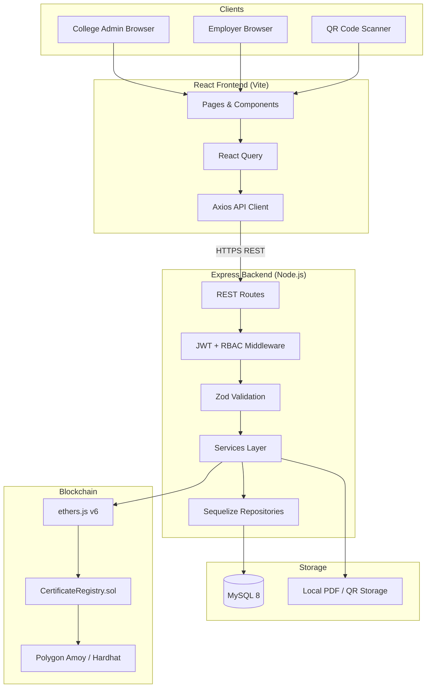
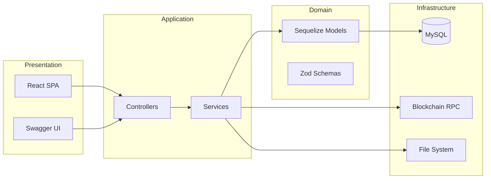
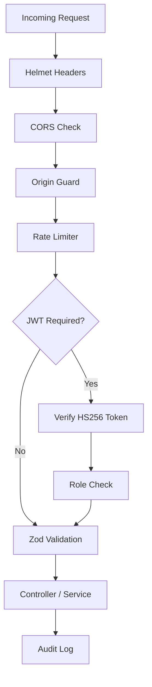

# Architecture Diagram

## System Overview



---

## Layered Architecture



---

## Monorepo Structure

```
College-Blockchain/
├── frontend/          @blockcert/frontend   TanStack Start + React
├── backend/           @blockcert/backend    Express + Sequelize
├── blockchain/        @blockcert/blockchain Hardhat + Solidity
├── demo/              Sample PDFs + generators
├── docs/              Project documentation
├── scripts/           setup.mjs, start.mjs, seed-demo.mjs
├── docker-compose.yml MySQL container
└── package.json       npm workspaces root
```

---

## Security Architecture



---

## Technology Stack

| Layer | Technology |
|-------|------------|
| Frontend | React 18, TypeScript, Vite, Tailwind, Shadcn UI, React Query |
| Backend | Node.js 20, Express, Sequelize, JWT, bcrypt, Winston |
| Database | MySQL 8.0 |
| Blockchain | Solidity 0.8.24, Hardhat, ethers.js v6, OpenZeppelin |
| Network | Polygon Amoy (80002) / Hardhat Local (31337) |
| DevOps | Docker Compose, npm workspaces |
