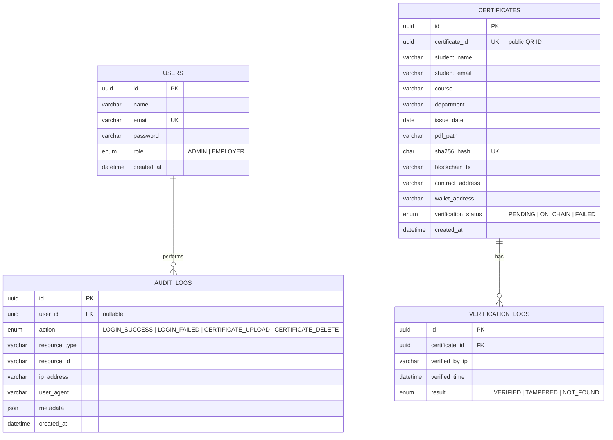

# Entity-Relationship Diagram

## Mermaid ER Diagram

---

## Relationships

| From | To | Cardinality | Description |
|------|-----|-------------|-------------|
| `users` | `audit_logs` | 1:N | Admin actions tracked with optional user FK |
| `certificates` | `verification_logs` | 1:N | Each verify attempt logged |
| `users` | `certificates` | — | No direct FK; issuer tracked via blockchain `wallet_address` |

---

## Key Design Decisions

1. **`certificate_id` vs `id`** — Internal `id` is the DB primary key. Public `certificate_id` (UUID) appears in QR codes and URLs — never expose internal `id`.

2. **`sha256_hash` unique** — Prevents duplicate PDF issuance at database level.

3. **No PII on blockchain** — Only the 32-byte hash is stored in `CertificateRegistry.sol`.

4. **Verification logs append-only** — Employers cannot delete verification history.

5. **Audit logs separate from verification logs** — Admin actions (login, upload, delete) vs public verification scans.

---

## Indexes

| Table | Index | Purpose |
|-------|-------|---------|
| `users` | `email` UNIQUE | Fast login lookup |
| `certificates` | `certificate_id` UNIQUE | QR lookup |
| `certificates` | `sha256_hash` UNIQUE | Duplicate detection |
| `certificates` | `blockchain_tx` | Explorer link lookup |
| `verification_logs` | `certificate_id` | History queries |
| `audit_logs` | `user_id`, `action`, `created_at` | Compliance queries |

See `backend/docs/DATABASE.md` for full column documentation.
