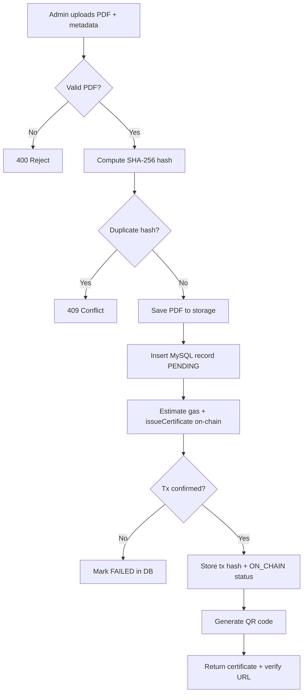
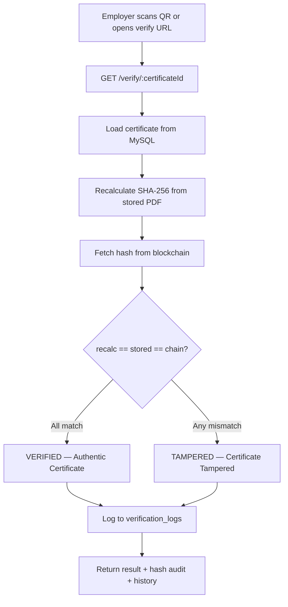
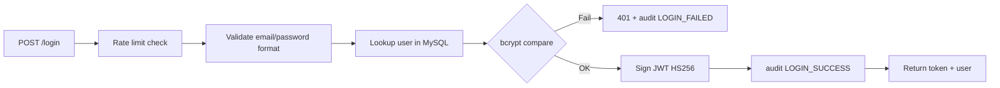
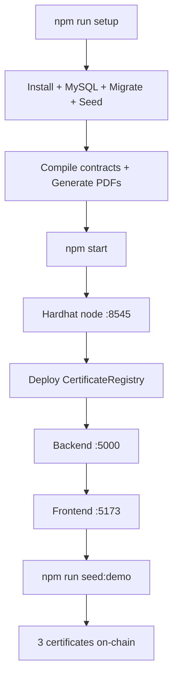

# Flow Diagrams

## Certificate Issuance Flow

---

## Employer Verification Flow

---

## Authentication Flow

---

## Local Development Flow

---

## Data Flow — What Goes Where

| Data | MySQL | Blockchain | File System |
|------|-------|--------------|-------------|
| Student name | ✓ | ✗ | ✗ |
| Course / department | ✓ | ✗ | ✗ |
| PDF bytes | ✗ | ✗ | ✓ |
| SHA-256 hash | ✓ | ✓ | ✗ |
| Transaction hash | ✓ | ✓ (receipt) | ✗ |
| QR code image | ✗ | ✗ | ✓ |
| Verification attempts | ✓ | ✗ | ✗ |
