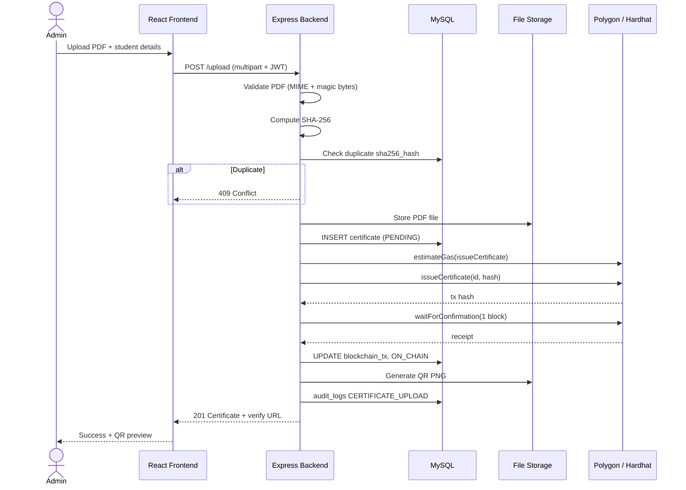
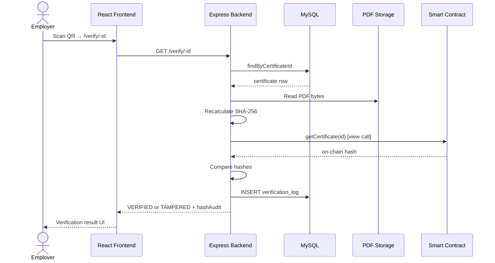
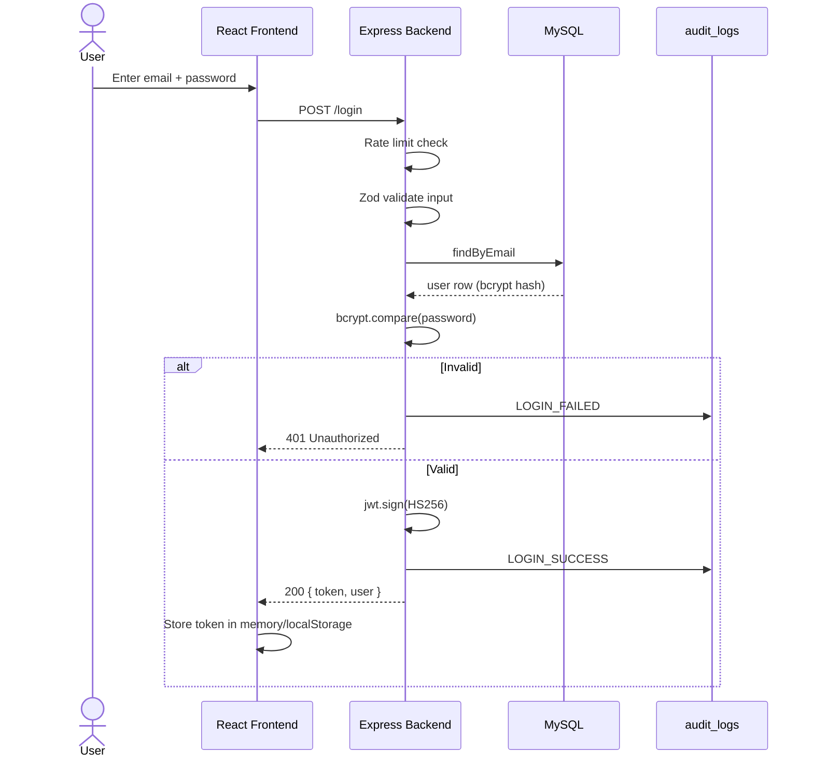
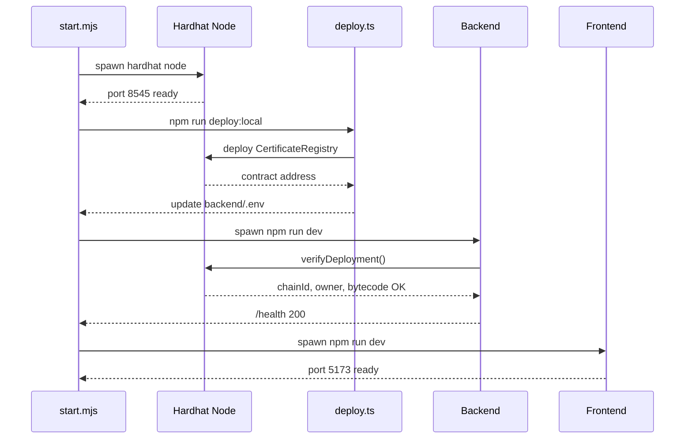
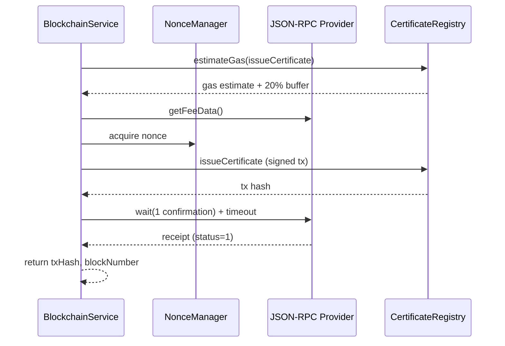

# Sequence Diagrams

## Certificate Upload Sequence

---

## Verification Sequence

---

## Login Sequence

---

## Startup Sequence (npm start)

---

## Blockchain Transaction Sequence

See `backend/docs/BLOCKCHAIN_INTEGRATION.md` for retry and error handling details.
